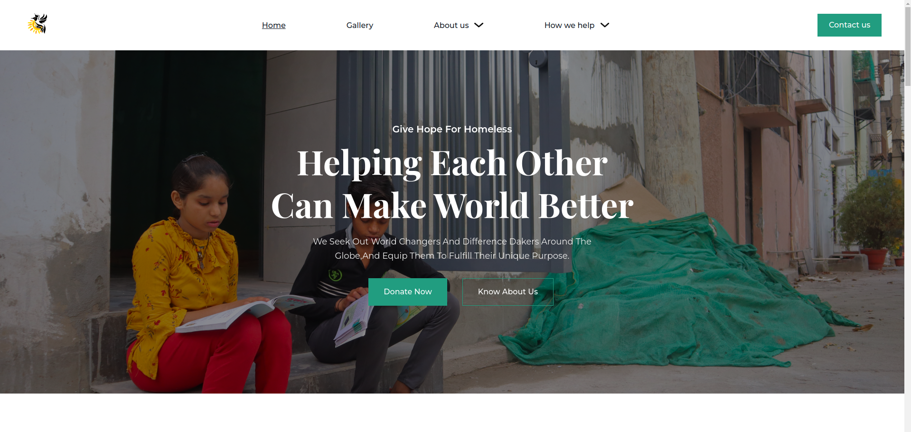

<h2><strong>Charity web application</strong></h2>
<br >

<hr >

<h4>Installation Guide</h4>
I'll assume you already have <strong>Node</strong> installed.

Start by cloning the repo:

```
https://github.com/bismarkboateng/ch-non-prf.git
cd ch-none-prf
yarn
yarn dev
```

select the link running on your development server to preview<br>
the application